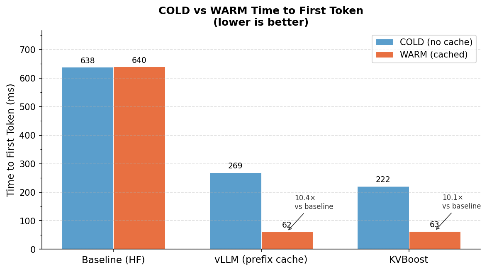
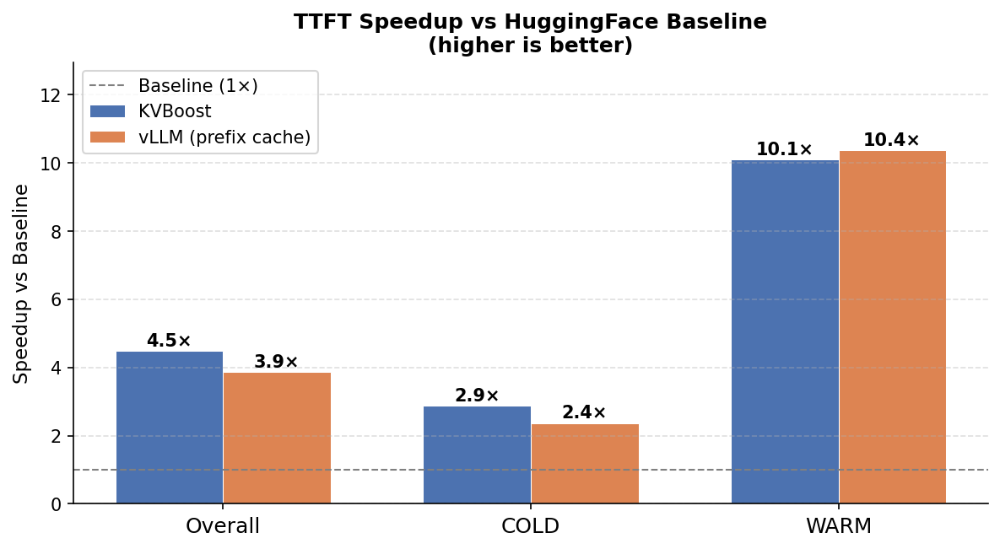
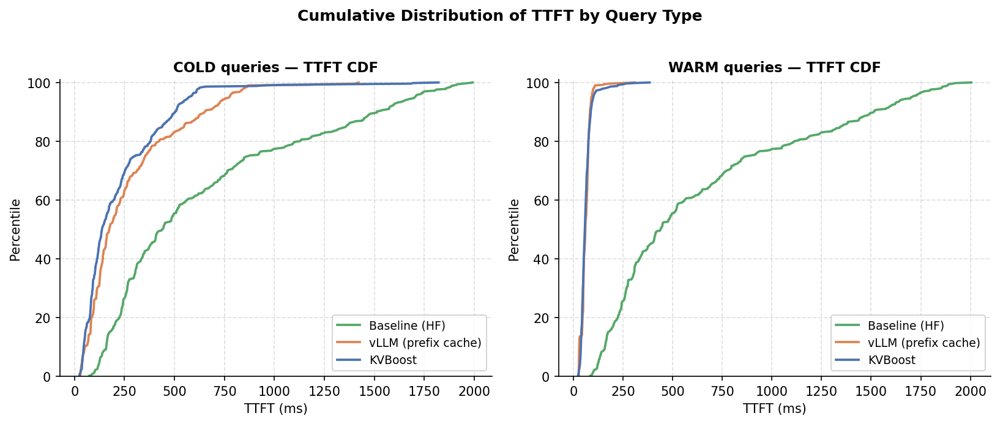
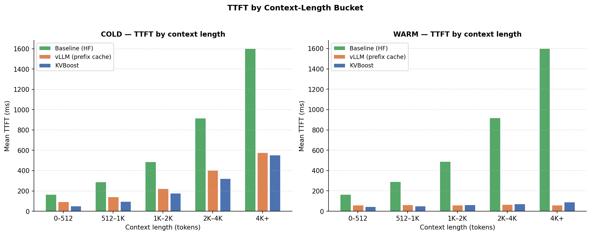
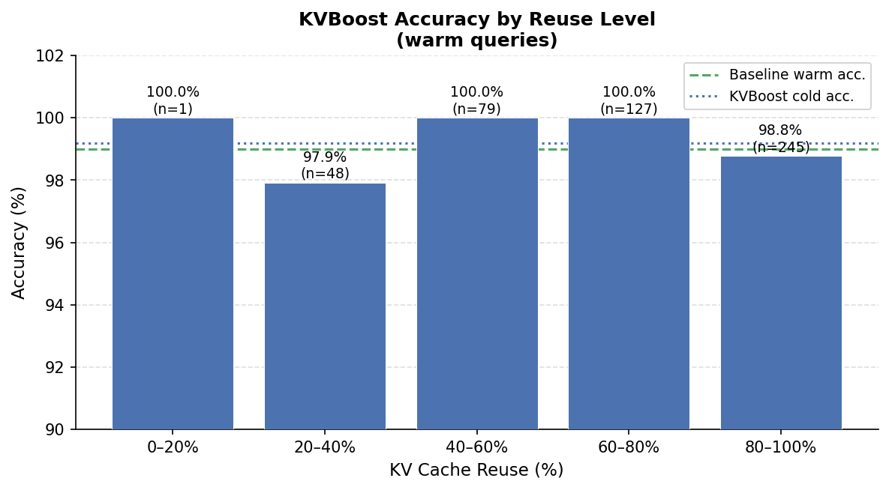
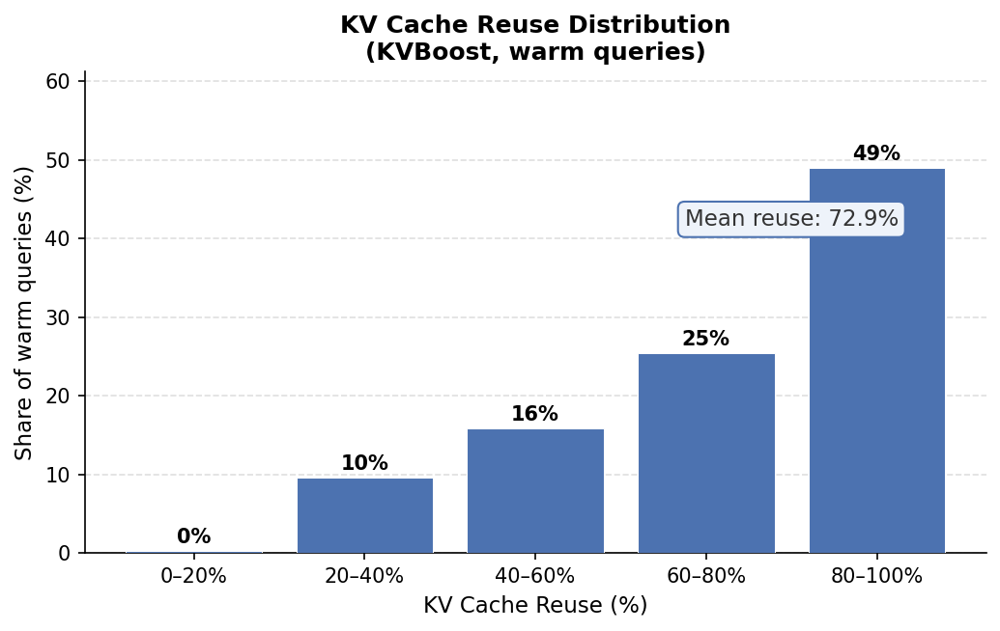

<p align="center">
  
</p>

<h1 align="center">KVBoost</h1>

<p align="center">
  <strong>Chunk-level KV cache reuse for HuggingFace inference.</strong><br>
  Reuse KV tensors across requests that share long prefixes. Drop-in on any HF causal LM.
</p>

<p align="center">
  <a href="https://pypi.org/project/kvboost/"></a>
  <a href="https://pypi.org/project/kvboost/"></a>
  <a href="https://kvboost.readthedocs.io/en/latest/"></a>
  <a href="LICENSE"></a>
  <a href="https://github.com/pythongiant/kvboost"></a>
</p>

<p align="center">
  <a href="#quick-start">Quick Start</a> &bull;
  <a href="#benchmarks">Benchmarks</a> &bull;
  <a href="#how-it-works">How it works</a> &bull;
  <a href="#when-kvboost-helps-and-when-it-doesnt">When it helps</a> &bull;
  <a href="#api-reference">API</a> &bull;
  <a href="https://kvboost.readthedocs.io/en/latest/">Docs</a>
</p>


## Quick start

```bash
pip install kvboost
```

```python
from kvboost import KVBoost

engine = KVBoost.from_pretrained("Qwen/Qwen2.5-3B")

# Warm the shared prefix once
engine.warm("You are a helpful coding assistant. Always be concise...")

# Subsequent generates reuse cached chunks automatically
result = engine.generate(
    "You are a helpful coding assistant. Always be concise...\n\n"
    "User: How do I reverse a linked list?\nAssistant:",
    max_new_tokens=128,
)

print(result.output_text)
print(f"TTFT: {result.ttft_ms:.1f} ms | reuse: {result.kv_reuse_ratio:.0%}")
```

From source:

```bash
git clone https://github.com/pythongiant/kvboost.git
cd kvboost
pip install -e .
```

Requirements: Python ≥ 3.9, PyTorch ≥ 2.1, Transformers ≥ 4.38.

---

## Flash Attention (CUDA)

KVBoost ships a custom **FlashAttention-2 CUDA kernel** that replaces the default O(N²) attention during KV encoding. It is optional — the library falls back gracefully if the extension is not built.

### Installation

**CPU / MPS only** (default install, no kernel):

```bash
pip install kvboost
# or from source:
pip install -e .
```

**With CUDA kernel** (Ampere, Ada, Hopper, Volta, Turing):

```bash
# Requires: CUDA toolkit ≥ 11.8, ninja (for fast compilation)
pip install kvboost[cuda]
# or from source:
FORCE_CUDA=1 pip install -e ".[cuda]"
```

The extension is compiled the first time you run `pip install`. Ninja is used automatically if available (much faster than the default `make` backend):

```bash
pip install ninja  # recommended
```

### What it does

The kernel implements tiled FlashAttention-2 with online softmax, reducing HBM memory traffic from O(N²) to O(N) during KV encoding. It is applied automatically to every attention module inside the loaded model — no code changes needed.

Supported:

| Property | Values |
|---|---|
| Dtypes | `float16`, `bfloat16` |
| Head dimensions | 64, 96, 128 |
| Sequence lengths | any (no power-of-2 requirement) |
| Causal masking | yes (skips future K/V tiles entirely) |
| GPU architectures | Volta (sm_70), Turing (sm_75), Ampere (sm_80/86), Ada (sm_89), Hopper (sm_90) |

Falls back to `torch.nn.functional.scaled_dot_product_attention` (which uses cuDNN FlashAttention on Ampere+) when the custom kernel is not compiled, and to vanilla SDPA on CPU/MPS.

### Checking which tier is active

```python
from kvboost import flash_attention_available, get_flash_attn_tier

print(get_flash_attn_tier())
# "kvboost_cuda"  — custom kernel compiled and loaded
# "torch_flash"   — torch SDPA flash path (cuDNN)
# "vanilla"       — standard SDPA (CPU/MPS or no flash support)

print(flash_attention_available())  # True if either accelerated tier is active
```

### Manual control

```python
from kvboost import install_flash_attention, uninstall_flash_attention

# Already called automatically by KVBoost.__init__ —
# only needed if you want to patch a model you loaded yourself:
n_patched = install_flash_attention(model)
print(f"Patched {n_patched} attention modules")

# Restore original attention (useful for ablation / debugging):
uninstall_flash_attention(model)
```

### CPU paged attention

For CPU-only deployments, KVBoost provides `CPUPagedEngine` — a drop-in replacement that manages KV tensors in a fixed block pool (PagedAttention-style) instead of growing contiguous tensors. Shared prefixes across requests share physical blocks via copy-on-write, eliminating redundant memory allocation.

```python
from kvboost import CPUPagedEngine

engine = CPUPagedEngine.from_pretrained(
    "Qwen/Qwen2.5-3B",
    max_cache_bytes=4_000_000_000,
    block_size=16,   # tokens per physical block
    num_blocks=8192, # total blocks in the pre-allocated pool
)
engine.warm("System prompt ...")
result = engine.generate("System prompt ...\n\nUser question", max_new_tokens=256)

print(engine.paged_stats())
# {'block_utilization': 0.12, 'free_blocks': 7168, 'used_blocks': 1024, ...}
```

`CPUPagedEngine` inherits all of KVBoost's chunk hashing, recompute strategies, and KV quantization — only the decode loop changes.

---

## How it works

The core idea is one sentence: **split the prompt into fixed-size chunks,
hash them, and on the next request load the K/V tensors for chunks you
have already computed instead of recomputing them.** Everything else is
making that produce correct outputs.

### 1. Chunking

[`chunk_registry.py`](src/kvboost/chunk_registry.py) splits the token
stream into fixed-size blocks (default 128). A 1000-token prompt becomes
7 full chunks plus a 104-token tail. With `--chunk-boundary-window=16`
the cut point slides up to ±16 tokens to avoid splitting mid-sentence,
which reduces seam error on natural-language prompts.

### 2. Two-level hashing

Each chunk gets two keys (see [`models.py`](src/kvboost/models.py)):

```
prefix_hash  = SHA256(previous_chunk.prefix_hash || this_chunk.tokens)
content_hash = SHA256(this_chunk.tokens)
```

The prefix hash only matches when the tokens *and every preceding chunk*
are identical — this is the case where stored K/V is directly usable.
The content hash is a fallback: the tokens match but the history doesn't,
so the stored K/V is approximately right but needs heavier correction.

### 3. Lookup and assembly

[`KVCacheManager.find_matching_chunks()`](src/kvboost/cache_manager.py)
tries prefix hash, then falls back to content hash, and flags approximate
matches. [`PromptAssembler`](src/kvboost/prompt_assembler.py) then splits
the prompt into a cached prefix (K/V loaded from memory) and a live
suffix (tokens the model still has to process).

Cache storage is an `OrderedDict` in CPU RAM with frequency-based
eviction; frequently-reused chunks (your system prompt) stay resident,
one-off chunks get evicted first. Overflow spills to a pre-allocated
binary file via [`disk_tier.py`](src/kvboost/disk_tier.py).

### 4. Seam repair

This is the part that makes stitching correct. Each cached chunk was
originally computed without seeing the chunks now preceding it in the new
prompt, so its K/V values are slightly wrong at the boundaries.

KVBoost has two strategies (`recompute_strategy=`):

- **`selective`** (default) re-runs the model on the last `R` tokens at
  each seam with the preceding cached context visible, and overwrites the
  stale K/V. Cheap but only fixes the boundary.
  ([`selective_recompute.py`](src/kvboost/selective_recompute.py))
- **`cacheblend`** does one forward pass, measures per-token cosine
  deviation vs. what the K/V would be with full context, and recomputes
  only the ~15% most-deviated tokens. Catches mid-chunk errors selective
  misses. ([`cacheblend.py`](src/kvboost/cacheblend.py))

Approximate (content-hash) matches force CacheBlend regardless of the
chosen strategy — position encodings are wrong in that case and
boundary-only repair is not enough.

Two optional continuity features stack on top of either strategy:

- `--overlap-k=16`: each chunk re-encodes the last K tokens of the
  previous chunk, so seam tokens always see K tokens of real preceding
  context at store time.
- `--sink-tokens=32`: always keep the first N tokens (the "attention
  sink") fully fresh, since many attention heads anchor on them.

### 5. Forward pass

The corrected cached K/V and the live suffix go into a single
`model.forward(past_key_values=...)` call in
[`engine.py`](src/kvboost/engine.py). Autoregressive decoding then
proceeds normally. After generation, any newly-seen chunks are written
back to the cache so the next request with overlapping text hits without
an explicit `warm()`.

### 6. Correctness guarantees

Under **greedy decoding**, the cached-and-corrected path is designed to
produce the argmax-equivalent token at every step — which matches what
the benchmark's `cosine = 1.000` columns show on the KV-side logits.
Despite this, *task* accuracy still drifts by a few points at high reuse.
Why? Because "argmax matches at step 1" does not guarantee "full
generation matches" — small K/V perturbations can tilt later tokens onto
a different branch. The accuracy-by-reuse table is the ground truth;
treat the logit-cosine metric as a necessary but not sufficient check.

Under **sampling** (temperature > 0), outputs differ run-to-run by
construction; the meaningful check is distributional (KL between logit
distributions), not token-identity.

### Optional: KV quantization

`kv_cache_bits=8` quantizes cached tensors (per-channel for K,
per-token for V — the KIVI-paper asymmetry) for ~2× RAM savings with
minimal accuracy loss. `kv_cache_bits=4` is available for 4× but you
should validate it with `verify_correctness()` on your workload before
trusting it.


## API reference

Minimum surface:

```python
KVBoost.from_pretrained(
    model_name_or_path: str,
    recompute_strategy: Literal["selective", "cacheblend", "none"] = "selective",
    chunk_size: int = 128,
    kv_cache_bits: Optional[Literal[4, 8]] = None,
    device: Optional[str] = None,          # "cuda" | "mps" | "cpu"
    ...
) -> KVBoost

engine.warm(text: str) -> WarmResult
engine.generate(prompt: str, max_new_tokens: int = ..., **kwargs) -> GenerationResult
engine.verify_correctness(prompts: list[str], ...) -> CorrectnessReport
```

`GenerationResult` exposes `output_text`, `ttft_ms`, `total_ms`,
`kv_reuse_ratio`, and the token-level traces used by the benchmarks.

Full docs: [kvboost.readthedocs.io](https://kvboost.readthedocs.io/en/latest/)


---

## Benchmarks

Results on **Qwen/Qwen2.5-3B**, **500 bug-localization samples** ([JetBrains-Research/lca-bug-localization](https://huggingface.co/datasets/JetBrains-Research/lca-bug-localization), max 6 000 context tokens).
Each backend ran in an isolated process for a clean GPU state. Accuracy measured as exact-match on 4-choice multiple-choice questions.

KVBoost config: `cacheblend` strategy, 1.5 GB cache, recency window 8, boundary window 16, overlap-k 16, sink tokens 32.

### Latency — Time to First Token



| Backend | TTFT mean | TTFT p95 | COLD mean | WARM mean | Throughput | vs Baseline |
|---|---|---|---|---|---|---|
| **KVBoost** | **142 ms** | 506 ms | 222 ms | **63 ms** | 11.7 tok/s | **4.49×** |
| vLLM (prefix cache) | 166 ms | 653 ms | 269 ms | **62 ms** | 13.2 tok/s | 3.86× |
| Baseline (HF) | 639 ms | 1 705 ms | 639 ms | 640 ms | 4.7 tok/s | 1.00× |

COLD = first query in a pair (no cached KVs). WARM = second query after the diff prefix is cached from the first.

KVBoost WARM TTFT is **3.5× faster than its own COLD** and **10.1× faster than Baseline**.
Both caching backends reach nearly identical WARM latency (~62–63 ms); KVBoost has a lower overall mean because its COLD path (222 ms) is faster than vLLM's (269 ms) due to chunk-level partial cache hits on first access.





The CDF shows that KVBoost's advantage is consistent across percentiles, not just at the mean — even the p95 warm latency (101 ms) is far below the baseline median (440 ms).



KVBoost's chunk-level partial cache hits let it outperform vLLM on COLD queries at every context-length bucket, because even a first-time request can hit cached chunks from earlier requests with overlapping text.

### Accuracy



| Backend | Overall | COLD | WARM | Avg KV reuse (warm) |
|---|---|---|---|---|
| **KVBoost** | **99.2%** | 99.2% | 99.2% | **72.9%** |
| vLLM (prefix cache) | 99.1% | 99.4% | 98.8% | — |
| Baseline (HF) | 99.1% | 99.2% | 99.0% | — |

Cold accuracy spread across backends is **0.2 pp**, confirming all three backends process identical inputs.
KVBoost WARM accuracy matches COLD exactly (99.2%) despite 72.9% average KV reuse — the CacheBlend seam repair produces no measurable quality degradation. The accuracy-by-reuse chart confirms this holds even at the 80–100% reuse bucket.

### KV Reuse Distribution (KVBoost, warm queries only)



| Reuse bucket | Share of warm queries |
|---|---|
| 80–100% | 49% |
| 60–80% | 25% |
| 40–60% | 16% |
| 20–40% | 10% |
| 0–20% | 0% |

49% of warm queries reuse more than 80% of their diff prefix from cache. Average: **72.9%**.

### GPU Memory

| Backend | Peak mean | Peak p95 | COLD mean | WARM mean |
|---|---|---|---|---|
| **KVBoost** | 6 126 MB | 6 495 MB | 6 140 MB | 6 111 MB |
| Baseline (HF) | 6 141 MB | 6 517 MB | 6 140 MB | 6 141 MB |

KVBoost warm queries use ~29 MB less peak memory than cold queries, as cached chunks skip the full prefill activation spike.
vLLM peak memory is managed internally by its engine and is not tracked via `torch.cuda.max_memory_allocated`.

---

## Inference server

KVBoost ships an OpenAI-compatible inference server with async prefix-grouped batching. Any client that speaks the OpenAI API works against it without modification.

### Installation

```bash
pip install 'kvboost[server]'
```

### Start the server

```bash
# Minimum
kvboost-server --model Qwen/Qwen2.5-3B

# Production config
kvboost-server \
    --model Qwen/Qwen2.5-3B \
    --host 0.0.0.0 \
    --port 8000 \
    --max-cache-bytes 4e9 \
    --recompute-strategy cacheblend \
    --kv-cache-bits 8 \
    --batch-window-ms 20 \
    --max-batch-size 8 \
    --warm "You are a helpful assistant."

# CPU-only with paged attention backend
kvboost-server \
    --model Qwen/Qwen2.5-3B \
    --backend cpu-paged \
    --block-size 16 \
    --num-blocks 8192
```

Or via Python:

```bash
python -m kvboost.server --model Qwen/Qwen2.5-3B
```

### Use with any OpenAI client

```python
from openai import OpenAI

client = OpenAI(base_url="http://localhost:8000/v1", api_key="kvboost")

# Chat completion
response = client.chat.completions.create(
    model="Qwen/Qwen2.5-3B",
    messages=[
        {"role": "system", "content": "You are a helpful assistant."},
        {"role": "user", "content": "Explain KV caching in one sentence."},
    ],
    max_tokens=128,
)
print(response.choices[0].message.content)

# Text completion (streaming)
for chunk in client.completions.create(
    model="Qwen/Qwen2.5-3B",
    prompt="The capital of France is",
    max_tokens=32,
    stream=True,
):
    print(chunk.choices[0].text, end="", flush=True)
```

Works with LangChain, LlamaIndex, and any other OpenAI-compatible framework.

### Endpoints

| Method | Path | Description |
|---|---|---|
| `GET` | `/health` | Liveness probe |
| `GET` | `/v1/models` | List loaded model |
| `POST` | `/v1/completions` | Text completion |
| `POST` | `/v1/chat/completions` | Chat completion |
| `GET` | `/v1/stats` | Queue, cache, and throughput diagnostics |
| `POST` | `/v1/warm` | Pre-warm KV cache with a prefix string |

All completion endpoints support `stream=true` (Server-Sent Events, same format as OpenAI).

### How batching works

```
Client A ──┐                    ┌── result A
Client B ──┤  BatchQueue        │
Client C ──┤  (20 ms window)    ├── result B
Client D ──┘  prefix grouping   └── result C, D (shared prefix → single batch)
```

1. Requests arrive at the FastAPI handler and are enqueued immediately (non-blocking).
2. The `BatchQueue` collects requests for `--batch-window-ms` (default 20 ms).
3. At the end of the window, requests are grouped by the hash of their first 3 prefix chunks. Requests sharing a prefix are dispatched as a single batch.
4. The `EngineWorker` calls `engine.generate_batch()` for each batch group — shared prefix KV is loaded once and broadcast (zero-copy) across the batch.
5. Results are resolved back to each caller's `asyncio.Future`.

Back-pressure: if the queue exceeds `--max-queue-size`, new requests receive HTTP 503. Requests not completed within 120 s receive HTTP 504.

### Server options

| Flag | Default | Description |
|---|---|---|
| `--model` | required | HuggingFace model name or local path |
| `--host` | `0.0.0.0` | Bind address |
| `--port` | `8000` | Port |
| `--device` | auto | `cuda` \| `mps` \| `cpu` |
| `--dtype` | `float16` | Model weight dtype |
| `--backend` | `default` | `default` (GPU/CPU) or `cpu-paged` |
| `--max-cache-bytes` | `2e9` | KV cache memory budget |
| `--recompute-strategy` | `cacheblend` | `selective` \| `cacheblend` \| `none` |
| `--kv-cache-bits` | `16` | `16` (off) \| `8` \| `4` |
| `--batch-window-ms` | `20` | Request collection window |
| `--max-batch-size` | `8` | Max requests per batch |
| `--max-queue-size` | `256` | Queue capacity before 503 |
| `--warm` | — | Pre-warm text (loaded before accepting traffic) |
| `--workers` | `1` | Engine thread-pool size (keep 1 for GPU) |

---

## License

[MIT](LICENSE)
