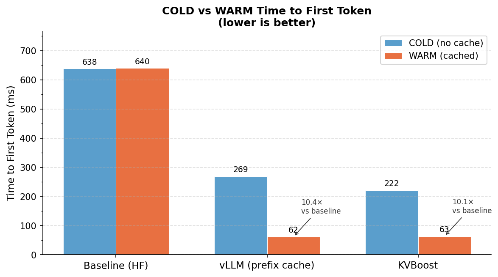
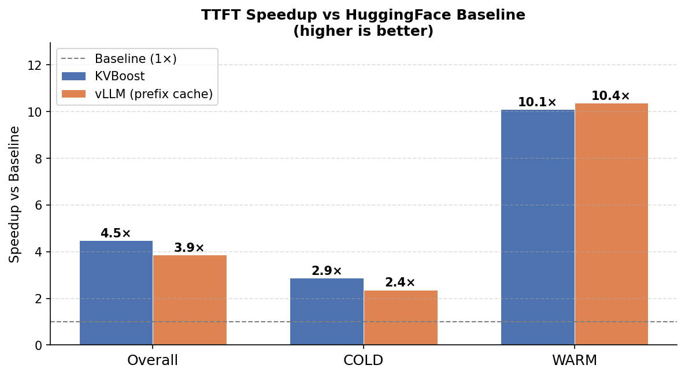
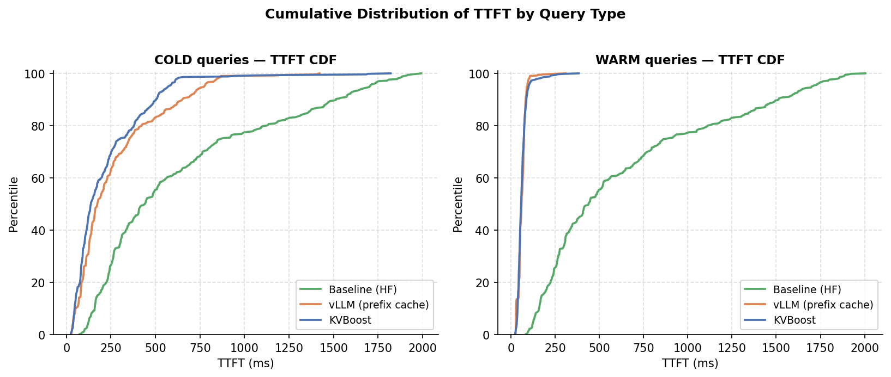
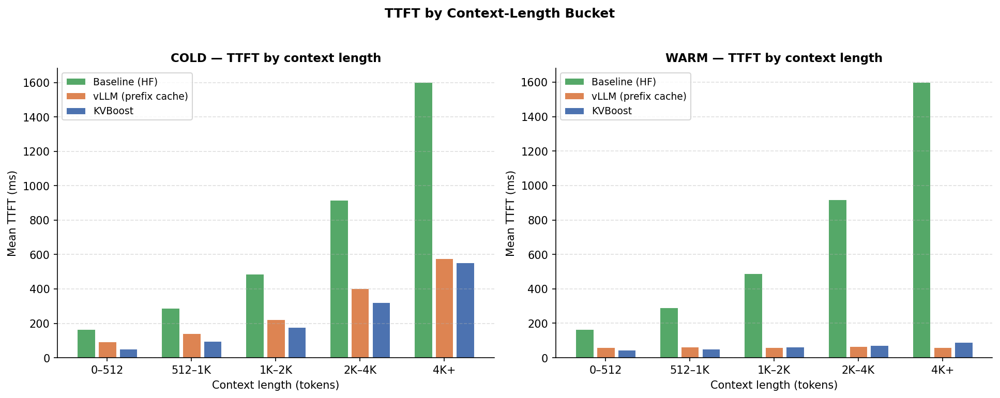
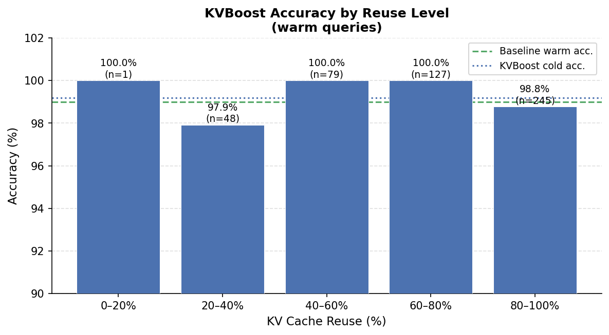
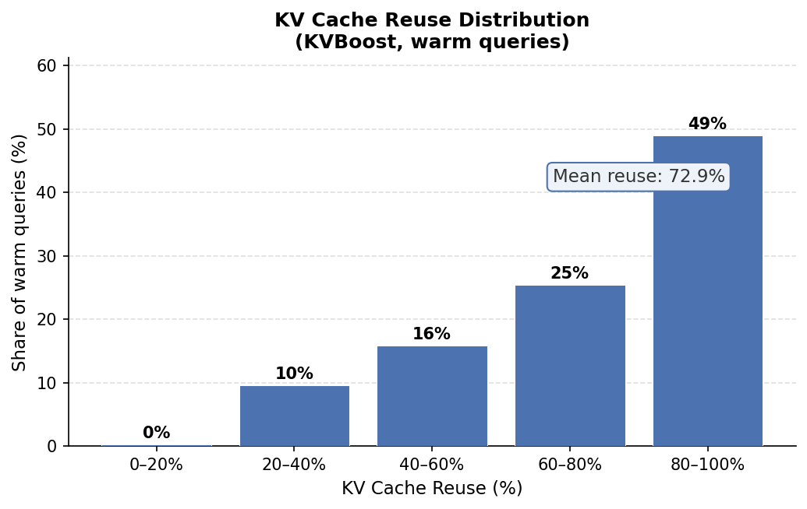

<p align="center">
  
</p>

<h1 align="center">KVBoost</h1>

<p align="center">
  <strong>A practical KV-cache toolkit for Hugging Face causal LMs.</strong><br>
  Cross-request prefix reuse, a custom FlashAttention-2 kernel, AWQ layer streaming,<br>
  and speculative decoding — behind a drop-in <code>from_pretrained</code> API and an<br>
  OpenAI-compatible server. Works in your existing stack without model porting.
</p>

<p align="center">
  <a href="https://pypi.org/project/kvboost/"></a>
  <a href="https://pypi.org/project/kvboost/"></a>
  <a href="https://kvboost.readthedocs.io/en/latest/"></a>
  <a href="LICENSE"></a>
  <a href="https://github.com/pythongiant/kvboost"></a>
</p>

<p align="center">
  <a href="#quick-start">Quick start</a> &bull;
  <a href="#core-features">Features</a> &bull;
  <a href="#use-it-from-an-openai-sdk-client">OpenAI server</a> &bull;
  <a href="#awq-layer-streaming-run-models-bigger-than-vram">AWQ streaming</a> &bull;
  <a href="#speculative-decoding-stacked-on-awq-streaming">Speculative</a> &bull;
  <a href="#benchmarks">Benchmarks</a> &bull;
  <a href="#how-it-works">How it works</a> &bull;
  <a href="#api-reference">API</a>
</p>

---

## Why KVBoost

Multi-turn chat, agent loops, and RAG pipelines spend most of their prefill time
re-encoding text they've already seen. KVBoost keeps a content-addressed KV
cache across requests so any prompt that shares a chunk-aligned prefix with a
prior one skips that work entirely — without changing your model, your
tokenizer, or the calling code.

On a 500-conversation ShareGPT replay (Qwen2.5-3B, RTX 4060 Laptop, 8 GB VRAM):

- **TTFT p50: 20 ms.** Flat from turn 1 through turn 8, while a no-cache
  baseline grows linearly to 122 ms.
- **4.59× faster than its own no-cache baseline** at turn 8 (~1 100 context
  tokens), with **≥99% KV reuse from turn 2 onward**.
- **No measurable accuracy loss** on a 500-sample bug-localization eval
  (99.2% WARM = 99.2% COLD at 73% average reuse).

Everything sits behind a standard `from_pretrained` call that returns a
generator with the same calling convention as Hugging Face — no graph
rewrites, no custom training format, no engine to learn.

## Core features

| | Feature | What it does |
|---|---|---|
| **Cache** | Chunk-level KV reuse | Content-addressed cache with boundary-aligned chunks. Hits across requests that share a chunk-aligned prefix, even when the prefix is not byte-identical. |
| | CacheBlend seam repair | Selective recompute at chunk boundaries keeps output quality identical to no-cache (≤0.2 pp drift on standard evals) even at >80% reuse. |
| | KV quantization | Optional 8-bit (KIVI-style asymmetric K/V) or 4-bit cache, for 2-4× cache-memory savings with minimal accuracy loss. |
| **Compute** | FlashAttention-2 CUDA kernel | Custom tiled-softmax kernel for Volta → Hopper (sm_70 through sm_90). Optional — falls back gracefully if not built. |
| | AWQ layer streaming | Run 32B-class models on 8 GB GPUs by streaming INT4 layer weights from pinned host RAM. PCIe transfer overlaps with compute via staging slots. |
| | Speculative decoding | Small AWQ draft proposes K tokens; streamed target verifies in one forward. Provably preserves the output distribution (greedy & sampling). |
| **Serving** | OpenAI-compatible HTTP server | `/v1/completions` and `/v1/chat/completions` with async prefix-grouped batching. Drop-in for the OpenAI SDK, LangChain, LlamaIndex, Instructor, and friends. |
| | Multi-backend | CUDA (full feature set), MPS (Apple Silicon, unified memory), CPU paged attention. |
| | Telemetry | `result.ttft_ms`, `result.kv_reuse_ratio`, scheduler hit rates, speculative acceptance histograms — surfaced through both the Python API and a `/v1/stats` endpoint. |

## Quick start

```bash
pip install kvboost                # CPU / MPS, pure-Python
pip install 'kvboost[cuda]'        # + custom FlashAttention-2 CUDA kernel
pip install 'kvboost[server]'      # + OpenAI-compatible HTTP server
```

Requirements: Python ≥ 3.9, PyTorch ≥ 2.1, Transformers ≥ 4.38.

### Use it as a library

Drop it in front of any Hugging Face causal LM. The returned engine has a
`generate()` method with the same shape as `transformers`, plus a
`GenerationResult` with timing and cache-hit telemetry:

```python
from kvboost import KVBoost

engine = KVBoost.from_pretrained("Qwen/Qwen2.5-3B")

# Optional: pre-warm a shared prefix (system prompt, retrieved context, etc.)
engine.warm("You are a helpful coding assistant. Always be concise...")

result = engine.generate(
    "You are a helpful coding assistant. Always be concise...\n\n"
    "User: How do I reverse a linked list?\nAssistant:",
    max_new_tokens=128,
)

print(result.output_text)
print(f"TTFT: {result.ttft_ms:.1f} ms | KV reuse: {result.kv_reuse_ratio:.0%}")
```

That's the whole integration. Subsequent `generate()` calls that share any
chunk-aligned prefix with a prior request hit cache automatically — no extra
API to learn.

### Use it from an OpenAI SDK client

If your code already talks to the OpenAI API, run the bundled server and
point `base_url` at it. Prefix caching, FlashAttention, AWQ streaming, and
speculative decoding all kick in transparently:

```bash
kvboost-server --model Qwen/Qwen2.5-3B --port 8000
```

```python
from openai import OpenAI

client = OpenAI(base_url="http://localhost:8000/v1", api_key="kvboost")

response = client.chat.completions.create(
    model="Qwen/Qwen2.5-3B",
    messages=[
        {"role": "system", "content": "You are a helpful coding assistant."},
        {"role": "user", "content": "How do I reverse a linked list?"},
    ],
    max_tokens=128,
)
print(response.choices[0].message.content)
```

The same endpoint works unmodified with LangChain (`ChatOpenAI`),
LlamaIndex (`OpenAI` LLM), Instructor, the Vercel AI SDK, and any other
client that targets an OpenAI-compatible base URL. See
[Inference server](#inference-server) for batching, KV-quant, and warm-up
flags.

### Install from source

```bash
git clone https://github.com/pythongiant/kvboost.git
cd kvboost
pip install -e .
```

---

## Flash Attention (CUDA)

KVBoost ships a custom **FlashAttention-2 CUDA kernel** that replaces the default O(N²) attention during KV encoding. It is optional — the library falls back gracefully if the extension is not built.

### Installation

**CPU / MPS only** (default install, no kernel):

```bash
pip install kvboost
# or from source:
pip install -e .
```

**With CUDA kernel** (Ampere, Ada, Hopper, Volta, Turing):

```bash
# Requires: CUDA toolkit ≥ 11.8, ninja (for fast compilation)
pip install kvboost[cuda]
# or from source:
FORCE_CUDA=1 pip install -e ".[cuda]"
```

The extension is compiled the first time you run `pip install`. Ninja is used automatically if available (much faster than the default `make` backend):

```bash
pip install ninja  # recommended
```

### What it does

The kernel implements tiled FlashAttention-2 with online softmax, reducing HBM memory traffic from O(N²) to O(N) during KV encoding. It is applied automatically to every attention module inside the loaded model — no code changes needed.

Supported:

| Property | Values |
|---|---|
| Dtypes | `float16`, `bfloat16` |
| Head dimensions | 64, 96, 128 |
| Sequence lengths | any (no power-of-2 requirement) |
| Causal masking | yes (skips future K/V tiles entirely) |
| GPU architectures | Volta (sm_70), Turing (sm_75), Ampere (sm_80/86), Ada (sm_89), Hopper (sm_90) |

Falls back to `torch.nn.functional.scaled_dot_product_attention` (which uses cuDNN FlashAttention on Ampere+) when the custom kernel is not compiled, and to vanilla SDPA on CPU/MPS.

### Checking which tier is active

```python
from kvboost import flash_attention_available, get_flash_attn_tier

print(get_flash_attn_tier())
# "kvboost_cuda"  — custom kernel compiled and loaded
# "torch_flash"   — torch SDPA flash path (cuDNN)
# "vanilla"       — standard SDPA (CPU/MPS or no flash support)

print(flash_attention_available())  # True if either accelerated tier is active
```

### Manual control

```python
from kvboost import install_flash_attention, uninstall_flash_attention

# Already called automatically by KVBoost.__init__ —
# only needed if you want to patch a model you loaded yourself:
n_patched = install_flash_attention(model)
print(f"Patched {n_patched} attention modules")

# Restore original attention (useful for ablation / debugging):
uninstall_flash_attention(model)
```

### CPU paged attention

For CPU-only deployments, KVBoost provides `CPUPagedEngine` — a drop-in replacement that manages KV tensors in a fixed block pool (PagedAttention-style) instead of growing contiguous tensors. Shared prefixes across requests share physical blocks via copy-on-write, eliminating redundant memory allocation.

```python
from kvboost import CPUPagedEngine

engine = CPUPagedEngine.from_pretrained(
    "Qwen/Qwen2.5-3B",
    max_cache_bytes=4_000_000_000,
    block_size=16,   # tokens per physical block
    num_blocks=8192, # total blocks in the pre-allocated pool
)
engine.warm("System prompt ...")
result = engine.generate("System prompt ...\n\nUser question", max_new_tokens=256)

print(engine.paged_stats())
# {'block_utilization': 0.12, 'free_blocks': 7168, 'used_blocks': 1024, ...}
```

`CPUPagedEngine` inherits all of KVBoost's chunk hashing, recompute strategies, and KV quantization — only the decode loop changes.

---

## AWQ Layer Streaming (run models bigger than VRAM)

KVBoost can run AWQ-quantized models whose weights **do not fit in GPU VRAM** by streaming layer weights from pinned host RAM into a pair of CUDA staging slots on demand. Embeddings, LM head, layernorms, and a configurable handful of "always-resident" decoder layers (first `keep_first_k` + last `keep_last_k`) stay in VRAM. The remaining decoder layers' projection weights live in host RAM and are DMA'd into a staging slot just before that layer's forward fires.

It's a **VRAM savings** feature, not a throughput feature. Use this when the model wouldn't otherwise load at all.

### Install

```bash
pip install "kvboost[streaming]"
# adds: safetensors, huggingface_hub, accelerate; on Linux x86, autoawq-kernels
```

### Run a 32B model on an 8 GB GPU

```bash
PYTHONPATH=src python -m kvboost.streaming.demo_partial_8b \
    --model Qwen/Qwen2.5-32B-Instruct-AWQ \
    --keep-first-k 4 --keep-last-k 4 \
    --prompt "Explain entropy in two sentences." \
    --max-new-tokens 32 --verbose
```

Real output on an 8 GB GPU (Qwen2.5-32B-Instruct-AWQ, ~19 GB packed):

```
INFO:kvboost.streaming.model_shell:Replaced projections:
    56 resident across 8 layers, 392 streamed across 56 layers
  load_time: 10.7s
  peak_vram_after_load: 5.65 GB
  prompt_tokens: 7

--- warm-up prefill ---
  prefill_time: 67.71s

--- generation ---
 Ent
  [  1/32] Δ_last=  1690ms  running= 0.59 tok/s
ropy is a measure of the disorder
  [  8/32] Δ_last=  1712ms  running= 0.58 tok/s
 or randomness in a system. It can
  [ 16/32] Δ_last=  1718ms  running= 0.58 tok/s
 also be thought of as the amount of
  [ 24/32] Δ_last=  1701ms  running= 0.58 tok/s
 energy in a system that is unavailable for
  [ 32/32] Δ_last=  1715ms  running= 0.58 tok/s

--- summary ---
  new_tokens:              32
  total_decode_time:       54.75s
  avg_tok_per_s:           0.61
  first_token_latency:     1690ms
  steady_state_ms_per_tok: 1712ms
  steady_state_tok_per_s:  0.61
  peak_vram_during_decode: 6.83 GB
```

The 32B model is **~2.4× larger than the GPU** and runs end-to-end without OOM. Output is fully coherent.

**Honest throughput by hardware tier** (Qwen2.5-32B-Instruct-AWQ, 22/64 layers resident):

| GPU class | Compute | Real Marlin | Realistic tok/s | Per-token DMA |
|---|---|---|---|---|
| **Turing laptop** (RTX 20-series, T4, RTX 5000) | sm_75, PCIe 3.0 | ✗ (falls back to `gemv_cuda`) | **~0.5 tok/s (≈30 tok/min)** | ~10 GB |
| **Ampere+ desktop/data center** (RTX 30/40, A100, L4) | sm_80+, PCIe 4.0+ | ✓ | ~2-5 tok/s | ~10 GB |

On laptop-class Turing hardware, **the floor is the INT4 GEMM, not PCIe**: Turing's 2nd-gen tensor cores can't run Marlin's tensor-core path, so each layer's quantized matmul runs on autoawq's `gemv_cuda` — correct but ~5-10× slower than Marlin on Ampere. The streaming pipeline successfully hides most of the PCIe transfer behind compute; the per-token cost is dominated by the GEMM kernel itself.

This is the point of the feature: **you trade tok/s for the ability to run a model that doesn't fit at all.** On the same Turing hardware, you can pick between "0.5 tok/s on Qwen-32B" or "no Qwen-32B." There's no software trick that turns a 2060/T4 into an A100.

### Programmatic use

```python
from kvboost.streaming import StreamingCausalLM, StreamingConfig
import torch

model = StreamingCausalLM.from_pretrained(
    "Qwen/Qwen2.5-32B-Instruct-AWQ",
    streaming_config=StreamingConfig(
        residency_mode="partial_resident",
        keep_first_k=4,
        keep_last_k=4,
    ),
    dtype=torch.float16,
)
# Behaves like a plain HF causal LM: model.generate(...), model(input_ids=...), etc.
```

Or layer the rest of KVBoost on top via the engine:

```python
from kvboost import KVBoost
from kvboost.streaming import StreamingConfig

engine = KVBoost.from_pretrained(
    "Qwen/Qwen2.5-32B-Instruct-AWQ",
    streaming_config=StreamingConfig(keep_first_k=4, keep_last_k=4),
    max_cache_bytes=1 * 1024**3,
)
result = engine.generate("...", max_new_tokens=64)
```

### How it works

| Phase | Where the bytes live | What runs |
|---|---|---|
| Indexing | safetensors on disk (memory-mapped) | `AWQLoader` builds a tensor-name → shard-offset map without loading anything |
| Resident materialization | GPU VRAM | Embeddings, LM head, all layernorms, and the projection weights of the first `keep_first_k` + last `keep_last_k` decoder layers are loaded once into `StreamingQLinear` modules |
| Streamed staging | Host pinned RAM | Remaining layers' AWQ-packed projections (`qweight`/`scales`/`qzeros`) are pinned for async DMA |
| Per-forward DMA | CUDA staging slots (2 × max layer size) | A `forward_pre_hook` on each streamed decoder layer asks the scheduler to DMA the next layer's weights into a slot on a dedicated transfer stream, then rebinds that layer's `StreamingQLinear` children to the slot views — Marlin's launch-config cache stays valid because the slot pointer is constant across forwards |
| Per-projection compute | GPU | Chunked, fused dequant+matmul keeps peak per-call memory to ~20 MB instead of the ~280 MB a dense materialization would need |

### Configuration

```python
StreamingConfig(
    residency_mode="partial_resident",   # full_resident | partial_resident | ffn_only_stream | full_stream
    keep_first_k=4,                      # decoder layers that stay in VRAM (head of network)
    keep_last_k=4,                       # decoder layers that stay in VRAM (tail)
    n_staging_slots=2,                   # 2 = full pipelining; 1 = serial fallback
    quant_kernel="auto",                 # auto | marlin | exllama_v2 | torch
)
```

| Knob | Effect |
|---|---|
| `keep_first_k` / `keep_last_k` | More resident = faster, more VRAM. With 32B on 8 GB the sweet spot is ~4 each; on a 4 GB GPU drop to 2 each |
| `residency_mode="ffn_only_stream"` | Attention weights resident, FFN weights streamed (FFN domi`nates layer bytes 2:1) — less peak VRAM at the same throughput |
| `quant_kernel="auto"` | Probes for Marlin / ExLlamaV2 at import time, falls back to a pure-torch chunked dequant if neither is available |

### Honest expectations

- **Throughput is hardware-bound, with the bottleneck depending on tier.** On Ampere+ with real Marlin tensor-core GEMM, the floor is PCIe (~13 GB DMA / token; ceiling ~2.5 tok/s on PCIe 4.0 x16). On Turing (RTX 20-series, T4, sm_75) the floor is the INT4 GEMM itself — Marlin's tensor-core path doesn't engage on 2nd-gen tensor cores, so `gemv_cuda` runs the matmul at ~5-10× the latency of Marlin on Ampere. Expect **~0.5 tok/s (30 tok/min)** on laptop-class Turing, **~2-5 tok/s** on Ampere+. The streaming pipeline correctly overlaps transfer with compute; the gap to fully resident is the cost of the hardware not being able to absorb 32B-class weights any faster.
- **First token is slow.** Prefill walks every layer once with cold staging; expect 10–60 s TTFT depending on prompt length and layer count. Subsequent tokens are at steady-state speed.
- **Pinned host RAM is required.** For 32B AWQ you'll pin ~19 GB of host RAM. Containers often default `ulimit -l` to 64 MB — set `ulimit -l unlimited` (or raise the cgroup `memory.lock_limit`) before running.
- **Unified-memory devices skip streaming.** On Apple Silicon (MPS) there is no separate VRAM, so the streaming pipeline auto-disables and weights are bound once to MPS. The wrapper still works as a way to load AWQ checkpoints HF can't load natively on Mac.

### Serve over HTTP (OpenAI-compatible) with streaming AWQ

The bundled FastAPI server can launch with the streaming backend, so the same `/v1/completions` and `/v1/chat/completions` endpoints work on models that don't fit in VRAM. Chunk reuse + SSE token streaming compose with it automatically:

```bash
pip install "kvboost[server,streaming]"

python -m kvboost.server \
    --model Qwen/Qwen2.5-32B-Instruct-AWQ \
    --awq-streaming \
    --keep-first-k 4 --keep-last-k 4 \
    --streaming-mode partial_resident \
    --max-cache-bytes 1e9 \
    --port 8000
```

Then talk to it like any OpenAI-compatible endpoint:

```bash
curl http://localhost:8000/v1/completions \
    -H "Content-Type: application/json" \
    -d '{
        "model": "Qwen/Qwen2.5-32B-Instruct-AWQ",
        "prompt": "Explain entropy in two sentences.",
        "max_tokens": 32,
        "stream": true
    }'
```

Each SSE chunk is a token; the per-token latency you see in the demo script (`demo_partial_8b`) is the same physical work each SSE chunk represents. Subsequent requests that share a prompt prefix get full chunk-reuse savings — the streaming backend doesn't change the KV-cache contract.

| Server flag | Purpose |
|---|---|
| `--awq-streaming` | Enable the streaming backend (required to unlock the rest) |
| `--streaming-mode` | `full_resident` / `partial_resident` / `ffn_only_stream` / `full_stream` |
| `--keep-first-k`, `--keep-last-k` | Decoder layers to keep resident at head / tail of network |
| `--streaming-quant-kernel` | `auto` (Marlin → ExLlamaV2 → torch fallback), or pin a specific one |

`--awq-streaming` is incompatible with `--gguf-file` and `--quantization` (the streaming loader reads AWQ tensors straight from safetensors; the model already has its own `quantization_config` in `config.json`).

### Files

- [src/kvboost/streaming/model_shell.py](src/kvboost/streaming/model_shell.py) — `StreamingCausalLM`, the wrapper + layer-replacement walker
- [src/kvboost/streaming/scheduler.py](src/kvboost/streaming/scheduler.py) — `StreamingScheduler` with `begin_forward` / `before_layer` / `after_layer` primitives
- [src/kvboost/streaming/staging.py](src/kvboost/streaming/staging.py) — staging-slot arena and layout
- [src/kvboost/streaming/awq_loader.py](src/kvboost/streaming/awq_loader.py) — safetensors indexing, pinned-host loading, marlin repack cache
- [src/kvboost/streaming/kernels/](src/kvboost/streaming/kernels/) — Marlin / ExLlamaV2 wrappers + chunked torch fallback
- [src/kvboost/server/__main__.py](src/kvboost/server/__main__.py) — `--awq-streaming` CLI flag and dispatch to `InferenceEngine.from_pretrained(streaming_config=...)`

---

## Speculative decoding (stacked on AWQ streaming)

When the target model is streamed, **every decode token costs one full host→GPU layer DMA**. A small resident draft can amortize that cost by proposing K tokens that the streamed target verifies in a single multi-token forward — the same physical streaming cycle, but yielding multiple tokens per cycle.

### Run

```bash
python -m kvboost.streaming.demo_speculative \
    --model       Qwen/Qwen2.5-32B-Instruct-AWQ \
    --draft-model Qwen/Qwen2.5-1.5B-Instruct-AWQ \
    --mode partial_resident \
    --keep-first-k 9 --keep-last-k 9 \
    --n-staging-slots 4 \
    --gamma 5 --max-new-tokens 60 \
    --prompt 'Explain entropy in two sentences.'
```

| Flag | Purpose |
|---|---|
| `--draft-model` | Small AWQ model with the same tokenizer family (e.g. Qwen2.5-1.5B for Qwen2.5-32B). Vocab parity is asserted at construction. |
| `--gamma` | Tokens drafted per verification round. Higher gamma = more potential speedup if acceptance holds, more wasted draft work if it doesn't. K=5 is a reasonable default. |
| `--spec-mode` | `greedy` (matches non-speculative greedy bit-for-bit) or `sampling` (target-distribution rejection sampling). |

### Measured speedup (Qwen2.5-32B-AWQ target + 1.5B-AWQ draft, RTX 3060 12 GB)

Same hardware, same prompt, same `keep_first_k = keep_last_k = 9`:

| Mode | Tokens/s (decode-only) | Tokens/s (wall, post warm-up) | Notes |
|---|---|---|---|
| Streaming, no speculation (`demo_partial_8b`) | 0.91 | 0.91 | 1 token per target forward |
| **Streaming + speculative (gamma=5)** | **2.79** | **2.30** | 3.0 tokens per target forward |

The decode-only ratio (2.79 / 0.91 ≈ **3.07×**) matches `avg_committed_per_round = 3.00` exactly — speculative wins by collapsing N target forwards into one. Acceptance on this prompt: 40% with 4/20 bonus rounds (all K drafted tokens accepted, plus the target's bonus).

### vs llama.cpp speculative (same model family, same hardware)

llama.cpp with the same target+draft pair, partial GPU offload (`-ngl 20`, comparable to KVBoost's 18 resident layers), and `--spec-type draft-simple`:

```bash
./build/bin/llama-cli \
    -m ~/models/qwen2.5-32b-instruct-q4_k_m-00001-of-00005.gguf \
    --model-draft ~/models/qwen2.5-1.5b-instruct-q4_k_m.gguf \
    --spec-type draft-simple \
    -ngl 20 --ctx-size 2048 \
    -p "Explain entropy in two sentences." -n 60
```

| Engine | Quant | Resident layers | Generation tok/s | Prompt tok/s |
|---|---|---|---|---|
| llama.cpp speculative | Q4_K_M GGUF | 20 (`-ngl 20`) | 1.9 | 24.0 |
| **KVBoost speculative (gamma=5)** | **AWQ INT4 + Marlin** | **18 (keep_first=keep_last=9)** | **2.30 (wall) / 2.79 (decode-only)** | ~24 |

KVBoost's decode is **~1.47× faster** than llama.cpp on the same prompt and roughly matched residency budget. The win comes from two places:

1. **Marlin INT4 tensor-core GEMM** on Ampere+, vs llama.cpp's mixed Q4_K_M kernels which don't engage tensor cores the same way.
2. **Async layer streaming with overlap** — KVBoost prefetches the next streamed layer's weights on a transfer stream while the current layer computes. `target.hit_rate = 1.000` in the telemetry confirms the pipeline stays ahead. llama.cpp's `-ngl 20` keeps the first 20 layers resident and recomputes the remaining 44 on CPU each token — no overlap.

Caveats for a fair read:

- Quant formats differ (AWQ vs Q4_K_M). They're both ~4-bit but the per-group scaling layouts aren't identical, so a tiny accuracy delta is expected on both sides.
- Prompt tok/s for KVBoost above is approximate — the warm-up prefill in `demo_speculative` includes cold-cache disk I/O. Post-warm-up re-prefill ran at ~3 tok/s for 7 tokens (very short prompt, dominated by per-call overhead, not steady-state); for prompts >100 tokens both engines converge to per-layer streaming/compute throughput.
- Both runs used greedy decoding. Output text is semantically equivalent across the two engines for this prompt.

### Telemetry surface

`demo_speculative` prints per-round timings and scheduler health so you can see exactly where time is going:

```
--- speculative stats ---
  rounds:                  20
  acceptance_rate:         0.400
  avg_committed/round:     3.00
  draft_time:              2.28s (avg 24.3ms/forward)
  verify_time:             21.51s (avg 1075.7ms/forward)
  rollback_time:           0.01s
  decode_only_tok_per_s:   2.79
  engine_overhead:         2.29s
  histogram (K=0..5):      [6, 3, 4, 2, 2, 3]

--- streaming scheduler stats ---
  target: forwards=22 layer_calls=1012 hits=1012 misses=0 hit_rate=1.000 ...
  draft:  fully resident (no scheduler)
```

What to look for:

- `avg_verify_ms_per_forward` ≈ baseline `steady_state_ms_per_tok` — verify pays the same streaming cost as a single-token forward. The speedup comes from `avg_committed/round`.
- `target.hit_rate` should be 1.000 with `--n-staging-slots ≥ 2`. Lower means prefetch is falling behind compute.
- `target.prefetches_sync > 0` means a layer was DMA'd on the critical path — set more staging slots or raise `keep_*` until misses stop.
- `draft` reports `None` (fully resident) — confirms the draft skipped scheduler installation.
- `engine_overhead` should be small (<5s) on a warm cache. Large values mean disk I/O during the timed window — repeat the run to amortize.

Programmatic access: `engine.speculative_stats()` and `engine.streaming_stats()` return the same dicts for `/v1/stats` integration.

### Honest expectations

- **Speedup ceiling = `avg_committed_per_round`, capped at `gamma + 1`.** No speculative scheme can beat the rate at which the target accepts drafts. For chat-style prompts with a good draft we typically see 2.5–4×; for code or low-entropy text, often higher; for adversarial / high-entropy text, can collapse to ~1×.
- **First token is dominated by prefill, not speculative.** Speculative only kicks in for the decode loop; prefill is one big multi-token forward on the target. Use `demo_partial_8b`-style warm-up if you want to measure decode alone.
- **Pinned host RAM still applies.** When pinning fails (e.g. container `RLIMIT_MEMLOCK = 64 KB`), the loader falls back to pageable + synchronous H2D — streaming overlap is lost for both baseline and speculative, but the relative speedup from speculation is preserved. See [AWQ streaming honest expectations](#honest-expectations) for the underlying limit and how to raise it.
- **Tokenizer parity is required.** The draft must share vocab with the target — a mismatch silently corrupts verification. Asserted strictly at construction.
- **Greedy mode is bit-for-bit identical to non-speculative greedy.** Sampling mode is distributionally equivalent to non-speculative sampling (target-distribution rejection sampling). Speculative never changes the output distribution.

### Files

- [src/kvboost/speculative/engine.py](src/kvboost/speculative/engine.py) — `SpeculativeEngine.decode_from` orchestrator
- [src/kvboost/speculative/verifier.py](src/kvboost/speculative/verifier.py) — single multi-token forward over the streamed target
- [src/kvboost/speculative/draft.py](src/kvboost/speculative/draft.py) — `DraftModel` (autoregressive K-step proposal)
- [src/kvboost/speculative/sampler.py](src/kvboost/speculative/sampler.py) — `verify_greedy` / `verify_sampling`
- [src/kvboost/speculative/rollback.py](src/kvboost/speculative/rollback.py) — KV truncation after partial acceptance
- [src/kvboost/speculative/stats.py](src/kvboost/speculative/stats.py) — acceptance histogram + per-round timings
- [src/kvboost/streaming/demo_speculative.py](src/kvboost/streaming/demo_speculative.py) — runnable demo with the telemetry block shown above

---

## How it works

The core idea is one sentence: **split the prompt into fixed-size chunks,
hash them, and on the next request load the K/V tensors for chunks you
have already computed instead of recomputing them.** Everything else is
making that produce correct outputs.

### 1. Chunking

[`chunk_registry.py`](src/kvboost/chunk_registry.py) splits the token
stream into fixed-size blocks (default 128). A 1000-token prompt becomes
7 full chunks plus a 104-token tail. With `--chunk-boundary-window=16`
the cut point slides up to ±16 tokens to avoid splitting mid-sentence,
which reduces seam error on natural-language prompts.

### 2. Two-level hashing

Each chunk gets two keys (see [`models.py`](src/kvboost/models.py)):

```
prefix_hash  = SHA256(previous_chunk.prefix_hash || this_chunk.tokens)
content_hash = SHA256(this_chunk.tokens)
```

The prefix hash only matches when the tokens *and every preceding chunk*
are identical — this is the case where stored K/V is directly usable.
The content hash is a fallback: the tokens match but the history doesn't,
so the stored K/V is approximately right but needs heavier correction.

### 3. Lookup and assembly

[`KVCacheManager.find_matching_chunks()`](src/kvboost/cache_manager.py)
tries prefix hash, then falls back to content hash, and flags approximate
matches. [`PromptAssembler`](src/kvboost/prompt_assembler.py) then splits
the prompt into a cached prefix (K/V loaded from memory) and a live
suffix (tokens the model still has to process).

Cache storage is an `OrderedDict` in CPU RAM with frequency-based
eviction; frequently-reused chunks (your system prompt) stay resident,
one-off chunks get evicted first. Overflow spills to a pre-allocated
binary file via [`disk_tier.py`](src/kvboost/disk_tier.py).

### 4. Seam repair

This is the part that makes stitching correct. Each cached chunk was
originally computed without seeing the chunks now preceding it in the new
prompt, so its K/V values are slightly wrong at the boundaries.

KVBoost has two strategies (`recompute_strategy=`):

- **`selective`** (default) re-runs the model on the last `R` tokens at
  each seam with the preceding cached context visible, and overwrites the
  stale K/V. Cheap but only fixes the boundary.
  ([`selective_recompute.py`](src/kvboost/selective_recompute.py))
- **`cacheblend`** does one forward pass, measures per-token cosine
  deviation vs. what the K/V would be with full context, and recomputes
  only the ~15% most-deviated tokens. Catches mid-chunk errors selective
  misses. ([`cacheblend.py`](src/kvboost/cacheblend.py))

Approximate (content-hash) matches force CacheBlend regardless of the
chosen strategy — position encodings are wrong in that case and
boundary-only repair is not enough.

Two optional continuity features stack on top of either strategy:

- `--overlap-k=16`: each chunk re-encodes the last K tokens of the
  previous chunk, so seam tokens always see K tokens of real preceding
  context at store time.
- `--sink-tokens=32`: always keep the first N tokens (the "attention
  sink") fully fresh, since many attention heads anchor on them.

### 5. Forward pass

The corrected cached K/V and the live suffix go into a single
`model.forward(past_key_values=...)` call in
[`engine.py`](src/kvboost/engine.py). Autoregressive decoding then
proceeds normally. After generation, any newly-seen chunks are written
back to the cache so the next request with overlapping text hits without
an explicit `warm()`.

### 6. Correctness guarantees

Under **greedy decoding**, the cached-and-corrected path is designed to
produce the argmax-equivalent token at every step — which matches what
the benchmark's `cosine = 1.000` columns show on the KV-side logits.
Despite this, *task* accuracy still drifts by a few points at high reuse.
Why? Because "argmax matches at step 1" does not guarantee "full
generation matches" — small K/V perturbations can tilt later tokens onto
a different branch. The accuracy-by-reuse table is the ground truth;
treat the logit-cosine metric as a necessary but not sufficient check.

Under **sampling** (temperature > 0), outputs differ run-to-run by
construction; the meaningful check is distributional (KL between logit
distributions), not token-identity.

### Optional: KV quantization

`kv_cache_bits=8` quantizes cached tensors (per-channel for K,
per-token for V — the KIVI-paper asymmetry) for ~2× RAM savings with
minimal accuracy loss. `kv_cache_bits=4` is available for 4× but you
should validate it with `verify_correctness()` on your workload before
trusting it.


## API reference

Minimum surface:

```python
KVBoost.from_pretrained(
    model_name_or_path: str,
    recompute_strategy: Literal["selective", "cacheblend", "none"] = "selective",
    chunk_size: int = 128,
    kv_cache_bits: Optional[Literal[4, 8]] = None,
    device: Optional[str] = None,          # "cuda" | "mps" | "cpu"
    ...
) -> KVBoost

engine.warm(text: str) -> WarmResult
engine.generate(prompt: str, max_new_tokens: int = ..., **kwargs) -> GenerationResult
engine.verify_correctness(prompts: list[str], ...) -> CorrectnessReport
```

`GenerationResult` exposes `output_text`, `ttft_ms`, `total_ms`,
`kv_reuse_ratio`, and the token-level traces used by the benchmarks.

Full docs: [kvboost.readthedocs.io](https://kvboost.readthedocs.io/en/latest/)


---

## Benchmarks

Results on **Qwen/Qwen2.5-3B**, **500 bug-localization samples** ([JetBrains-Research/lca-bug-localization](https://huggingface.co/datasets/JetBrains-Research/lca-bug-localization), max 6 000 context tokens).
Each backend ran in an isolated process for a clean GPU state. Accuracy measured as exact-match on 4-choice multiple-choice questions.

KVBoost config: `cacheblend` strategy, 1.5 GB cache, recency window 8, boundary window 16, overlap-k 16, sink tokens 32.


---

## ShareGPT Multi-Turn Replay — KVBoost vs vLLM Prefix Cache

**Methodology**: 500 real ShareGPT conversations replayed turn-by-turn on
`Qwen/Qwen2.5-3B` (RTX 4060 Laptop, 8 GB VRAM). History accumulates naturally
across turns — exactly as a real user session would. Both backends generate up
to 128 new tokens per turn.

- **KVBoost**: `cacheblend` recompute strategy, chunk=128, boundary_window=16, overlap_k=16, sink_tokens=32
- **vLLM**: prefix caching enabled (`enable_prefix_caching=True`), `max_model_len=8192`, `gpu_memory_utilization=0.90`

> **Note on vLLM TTFT**: vLLM's `RequestMetrics.first_token_time` is `None` in
> offline/sync mode, so the reported TTFT falls back to total generation time
> (prefill + decode). These numbers are **not** comparable to KVBoost's true
> TTFT and are included here for cache-hit-ratio completeness only. A proper
> vLLM TTFT comparison requires the async `AsyncLLMEngine` with streaming.

### Overall Summary

| Metric | KVBoost | vLLM (prefix cache) |
|---|---|---|
| Conversations | 500 | 500 |
| Total turns | 2 485 | 2 521 |
| TTFT p50 (ms) | **20.1** | 3 328 †|
| TTFT p90 (ms) | **23.6** | 3 350 †|
| TTFT p99 (ms) | **29.3** | 3 409 †|
| Avg cache hit ratio | **86.1%** | 70.6% |
| Throughput (rps) | 0.278 | **0.319** |

† vLLM TTFT = total generation time (first_token_time unavailable in sync mode).

### TTFT vs Turn Number (KVBoost only — true TTFT)

| Turn | N | Avg ctx tokens | Baseline TTFT | KVBoost TTFT | Speedup | KV reuse |
|---|---|---|---|---|---|---|
| 1 | 500 |  54 | 18.8 ms | 17.4 ms | 1.08× | 35.7% |
| 2 | 500 | 206 | 23.1 ms | 19.9 ms | 1.16× | 96.9% |
| 3 | 500 | 371 | 35.2 ms | 20.6 ms | 1.71× | 99.2% |
| 4 | 383 | 532 | 48.9 ms | 21.3 ms | 2.29× | 99.4% |
| 5 | 265 | 690 | 63.7 ms | 22.5 ms | 2.83× | 99.6% |
| 6 | 172 | 826 | 82.4 ms | 23.6 ms | 3.49× | 99.6% |
| 7 | 106 | 964 | 102.8 ms | 24.6 ms | 4.18× | 99.6% |
| 8 |  59 | 1114 | 121.6 ms | 26.5 ms | **4.59×** | 99.6% |

KVBoost TTFT stays essentially flat (~17–27 ms) as context grows. Baseline
TTFT scales linearly with history length.

### Cache Hit Rate vs Turn Number

| Turn | KVBoost KV reuse | vLLM prefix cache hit |
|---|---|---|
| 1 (cold) | 35.7% | 0.0% |
| 2 | 96.9% | 76.3% |
| 3 | 99.2% | 88.3% |
| 4 | 99.4% | 91.9% |
| 5 | 99.6% | 93.7% |
| 6 | 99.6% | 95.2% |
| 7 | 99.6% | 95.5% |
| 8 | 99.6% | 95.9% |

KVBoost achieves higher cache reuse from turn 2 onward because it operates at
chunk granularity with a boundary-alignment window, recovering cache hits even
when the prefix is not byte-identical. vLLM prefix caching requires an exact
token-level prefix match, so new assistant tokens from the previous turn reduce
the matchable prefix length.

### Key Takeaways

1. **TTFT scaling**: KVBoost TTFT grows only 9 ms from turn 1 to turn 8
   (+52%) while the baseline grows 103 ms (+547%). At turn 8, KVBoost is
   **4.6× faster** than its own no-cache baseline.

2. **Cache hit rate**: KVBoost stabilises at ≥99% reuse after turn 2; vLLM
   prefix cache reaches ~96% at turn 8, starting lower because exact-prefix
   matching misses tokens changed by generation.

3. **Throughput parity**: Both backends achieve similar throughput (~0.28–0.32
   rps) on this single-GPU setup — the difference is dominated by generation
   decode time, not TTFT.

4. **vLLM TTFT caveat**: The vLLM numbers require async streaming to measure
   true TTFT. The current sync fallback measures total latency, making direct
   TTFT comparison misleading.

### Plots

| KVBoost | vLLM |
|---|---|
| `sharegpt_replay/results/sharegpt_ttft_vs_turn.png` | `vllm_sharegpt_replay/results/vllm_sharegpt_ttft_vs_turn.png` |

To regenerate plots from saved JSON:
```bash
python sharegpt_replay/plot_results.py
python vllm_sharegpt_replay/plot_results.py
```

---

### Latency — Time to First Token



| Backend | TTFT mean | TTFT p95 | COLD mean | WARM mean | Throughput | vs Baseline |
|---|---|---|---|---|---|---|
| **KVBoost** | **142 ms** | 506 ms | 222 ms | **63 ms** | 11.7 tok/s | **4.49×** |
| vLLM (prefix cache) | 166 ms | 653 ms | 269 ms | **62 ms** | 13.2 tok/s | 3.86× |
| Baseline (HF) | 639 ms | 1 705 ms | 639 ms | 640 ms | 4.7 tok/s | 1.00× |

COLD = first query in a pair (no cached KVs). WARM = second query after the diff prefix is cached from the first.

KVBoost WARM TTFT is **3.5× faster than its own COLD** and **10.1× faster than Baseline**.
Both caching backends reach nearly identical WARM latency (~62–63 ms); KVBoost has a lower overall mean because its COLD path (222 ms) is faster than vLLM's (269 ms) due to chunk-level partial cache hits on first access.





The CDF shows that KVBoost's advantage is consistent across percentiles, not just at the mean — even the p95 warm latency (101 ms) is far below the baseline median (440 ms).



KVBoost's chunk-level partial cache hits let it outperform vLLM on COLD queries at every context-length bucket, because even a first-time request can hit cached chunks from earlier requests with overlapping text.

### Accuracy



| Backend | Overall | COLD | WARM | Avg KV reuse (warm) |
|---|---|---|---|---|
| **KVBoost** | **99.2%** | 99.2% | 99.2% | **72.9%** |
| vLLM (prefix cache) | 99.1% | 99.4% | 98.8% | — |
| Baseline (HF) | 99.1% | 99.2% | 99.0% | — |

Cold accuracy spread across backends is **0.2 pp**, confirming all three backends process identical inputs.
KVBoost WARM accuracy matches COLD exactly (99.2%) despite 72.9% average KV reuse — the CacheBlend seam repair produces no measurable quality degradation. The accuracy-by-reuse chart confirms this holds even at the 80–100% reuse bucket.

### KV Reuse Distribution (KVBoost, warm queries only)



| Reuse bucket | Share of warm queries |
|---|---|
| 80–100% | 49% |
| 60–80% | 25% |
| 40–60% | 16% |
| 20–40% | 10% |
| 0–20% | 0% |

49% of warm queries reuse more than 80% of their diff prefix from cache. Average: **72.9%**.

### GPU Memory

| Backend | Peak mean | Peak p95 | COLD mean | WARM mean |
|---|---|---|---|---|
| **KVBoost** | 6 126 MB | 6 495 MB | 6 140 MB | 6 111 MB |
| Baseline (HF) | 6 141 MB | 6 517 MB | 6 140 MB | 6 141 MB |

KVBoost warm queries use ~29 MB less peak memory than cold queries, as cached chunks skip the full prefill activation spike.
vLLM peak memory is managed internally by its engine and is not tracked via `torch.cuda.max_memory_allocated`.

---

## Inference server

KVBoost ships an OpenAI-compatible inference server with async prefix-grouped batching. Any client that speaks the OpenAI API works against it without modification.

### Installation

```bash
pip install 'kvboost[server]'
```

### Start the server

```bash
# Minimum
kvboost-server --model Qwen/Qwen2.5-3B

# Production config
kvboost-server \
    --model Qwen/Qwen2.5-3B \
    --host 0.0.0.0 \
    --port 8000 \
    --max-cache-bytes 4e9 \
    --recompute-strategy cacheblend \
    --kv-cache-bits 8 \
    --batch-window-ms 20 \
    --max-batch-size 8 \
    --warm "You are a helpful assistant."

# CPU-only with paged attention backend
kvboost-server \
    --model Qwen/Qwen2.5-3B \
    --backend cpu-paged \
    --block-size 16 \
    --num-blocks 8192
```

Or via Python:

```bash
python -m kvboost.server --model Qwen/Qwen2.5-3B
```

### Use with any OpenAI client

```python
from openai import OpenAI

client = OpenAI(base_url="http://localhost:8000/v1", api_key="kvboost")

# Chat completion
response = client.chat.completions.create(
    model="Qwen/Qwen2.5-3B",
    messages=[
        {"role": "system", "content": "You are a helpful assistant."},
        {"role": "user", "content": "Explain KV caching in one sentence."},
    ],
    max_tokens=128,
)
print(response.choices[0].message.content)

# Text completion (streaming)
for chunk in client.completions.create(
    model="Qwen/Qwen2.5-3B",
    prompt="The capital of France is",
    max_tokens=32,
    stream=True,
):
    print(chunk.choices[0].text, end="", flush=True)
```

Works with LangChain, LlamaIndex, and any other OpenAI-compatible framework.

### Endpoints

| Method | Path | Description |
|---|---|---|
| `GET` | `/health` | Liveness probe |
| `GET` | `/v1/models` | List loaded model |
| `POST` | `/v1/completions` | Text completion |
| `POST` | `/v1/chat/completions` | Chat completion |
| `GET` | `/v1/stats` | Queue, cache, and throughput diagnostics |
| `POST` | `/v1/warm` | Pre-warm KV cache with a prefix string |

All completion endpoints support `stream=true` (Server-Sent Events, same format as OpenAI).

### How batching works

```
Client A ──┐                    ┌── result A
Client B ──┤  BatchQueue        │
Client C ──┤  (20 ms window)    ├── result B
Client D ──┘  prefix grouping   └── result C, D (shared prefix → single batch)
```

1. Requests arrive at the FastAPI handler and are enqueued immediately (non-blocking).
2. The `BatchQueue` collects requests for `--batch-window-ms` (default 20 ms).
3. At the end of the window, requests are grouped by the hash of their first 3 prefix chunks. Requests sharing a prefix are dispatched as a single batch.
4. The `EngineWorker` calls `engine.generate_batch()` for each batch group — shared prefix KV is loaded once and broadcast (zero-copy) across the batch.
5. Results are resolved back to each caller's `asyncio.Future`.

Back-pressure: if the queue exceeds `--max-queue-size`, new requests receive HTTP 503. Requests not completed within 120 s receive HTTP 504.

### Server options

| Flag | Default | Description |
|---|---|---|
| `--model` | required | HuggingFace model name or local path |
| `--host` | `0.0.0.0` | Bind address |
| `--port` | `8000` | Port |
| `--device` | auto | `cuda` \| `mps` \| `cpu` |
| `--dtype` | `float16` | Model weight dtype |
| `--backend` | `default` | `default` (GPU/CPU) or `cpu-paged` |
| `--max-cache-bytes` | `2e9` | KV cache memory budget |
| `--recompute-strategy` | `cacheblend` | `selective` \| `cacheblend` \| `none` |
| `--kv-cache-bits` | `16` | `16` (off) \| `8` \| `4` |
| `--batch-window-ms` | `20` | Request collection window |
| `--max-batch-size` | `8` | Max requests per batch |
| `--max-queue-size` | `256` | Queue capacity before 503 |
| `--warm` | — | Pre-warm text (loaded before accepting traffic) |
| `--workers` | `1` | Engine thread-pool size (keep 1 for GPU) |

---

## License

[MIT](LICENSE)
